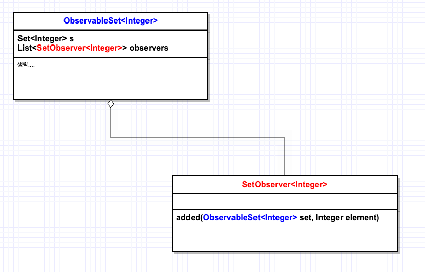

# 과도한 동기화는 피하라

응답불가와 안전 실패를 피하려면 동기화 메서드나 동기화 블록 안에서는 제어를 절대로 클라이언트에 양도하면 안 된다.
- 응답불가는 무한 Loop를 생각하면된다. 
- 안전실패는 코드 실행은 완료되었으나 계산된 결과값이 잘못된 경우를 말한다.

## 외계인 메서드 

동기회된 영역(synchronized 블럭)내에 재정의 할 수 있는 메서드는 호출하면 안된다!!
- synchronized 블럭을 호출하는 클라이언트가 블럭내 로직을 변경할 수 있도록 해선 안된다!!

클라이언트가 넘겨준 함수 객체를 호출해서도 안된다.
- synchronized 블럭안에서 클라이언트로부터 받은 로직을 실행해서는 안된다!!

클래스 관점에서는 위 2개의 상황에서 실행되는 메서드들은 통제가 불가능하고, 정체를 알수 없는 `외계인 메소드(alien method)`이다.

## 예시 코드 - ConcurrentModificationException

```java
public class ObservableSet<E> extends ForwardingSet<E> {

    public ObservableSet(Set<E> s) {
        super(s);
    }

    private final List<SetObserver<E>> observers = new ArrayList<>();

    public List<SetObserver<E>> getObservers() {
        return observers;
    }

    public void addObserver(SetObserver<E> observer) {
        synchronized (observers) {
            observers.add(observer);
        }
    }

    public boolean removeObserver(SetObserver<E> observer) {
        synchronized (observers) {
            return observers.remove(observer); // observers가 다른 동기화에 사용중이라면?!
        }
    }

    private void notifyElementAdded(E element) {
        synchronized (observers) {
            for (SetObserver<E> observer : observers) {
                observer.added(this, element); // added에서 무엇을 하는지 살펴봐라!
            }
        }
    }

    @Override
    public boolean add(E element) {
        boolean added = super.add(element); // 상위 Set에 추가
        if (added) {
            notifyElementAdded(element); // s에 값이 추가되었다는 것을 다른 옵저버들에게 알린다!!
        }
        return added;
    }

    @Override
    public boolean addAll(Collection<? extends E> c) {
        boolean result = false;
        for (E element : c) {
            result |= add(element);
        }
        return result;
    }


}
```



메인 메소드를 작성해보자.

옵저버 1개를 추가하고 Set<Ineger>에 0~99까지의 숫자를 넣으면서 옵저버의 added가 실행되도록 하는 로직이다.

CASE 1,2가 정상적으로 수행될것으로 보이지만 CASE 2에서 ConcurrentModificationException이 발생한다.

add 메소드를 실행하게 되면, 내부적으로 notifyElementAdded 메소드(옵저버 알림)가 실행된다. 
이때 notifyElementAdded 메소드는 observers에 대한 Lock을 얻는다.

옵저버의 added 메소드 실행 중에 removeObserver 메소드를 통해서 observers에 있는 observer를 제거하려고 한다.

그러나 observers는 notifyElementAdded 메소드에서 이미 Lock이 잡혀있기 때문에 ConcurrentModificationException이 발생한다.

즉, Lock을 걸어두더라도 자신이 로직을 수행하는 과정에서 observers에 대한 값 수정이 발생해도 인식 할 수 없다!

```java
public class Item79Main {

    public static void main(String[] args) {

        /**
         * CASE 1 : 옵저버 1개를 추가한다. 옵저버는 출력만 수행한다.
         */
        ObservableSet<Integer> set = new ObservableSet<>(new HashSet<>());

        set.addObserver((s,e) -> System.out.println(e));

        for (int i = 0; i < 100; i++) {
            set.add(i); // i가 추가 되었다. 알려라!
        }


        /**
         * CASE 2 : 옵저버 1개를 추가한다. 옵저버는 출력과 추가된 값이 23이면 자신을(옵저버) 제거한다!
         */
        ObservableSet<Integer> set2 = new ObservableSet<>(new HashSet<>());

        set2.addObserver(new SetObserver<Integer>() {
            @Override
            public void added(ObservableSet<Integer> s, Integer e) {
                System.out.println(e);
                if (e == 23) {
                    s.removeObserver(this);
                }
            }
        });

        for (int i = 0; i < 100; i++) {
            set2.add(i); // i가 추가 되었다. 알려라!
        }

    }

}
```

그러므로 동기화 블록내에선 외부 로직이 실행되도록 하지 말자!!!

## 예시 코드2 - 교착상태

ExecutorService를 통해서 별도의 쓰레드를 하나 만들어서 옵저버 삭제를 시도한다.

removeObserver 메소드를 실행하기 위해서 observers에 대한 Lock을 걸려고 한다. 
하지만 이미 notifyElementAdded에서 observers에 대한 Lock을 가지고 있으므로 Lock을 얻지못한다.

notifyElementAdded에서는 옵저버의 added를 실행이 끝날때까지 기다리는데 removeObserver가 Lock을 얻지 못했으므로 계속 대기만 하게된다.
(교착상태)

살짝 억지스러운 예지만, 실제 시스템(특히 GUI 툴킷)에서도 동기화된 영역 안에서 외계인 메서드를 호출하여 교착상태에 빠지는 사례는 자주 있다.

```java
/**
 * CASE 3 : 옵저버 1개를 추가한다. 옵저버는 출력과 추가된 값이 23인 경우 관찰자 잠그기 시도를 한다.
 */
ObservableSet<Integer> set3 = new ObservableSet<>(new HashSet<>());

set3.addObserver(new SetObserver<Integer>() {
    @Override
    public void added(ObservableSet<Integer> s, Integer e) {
        System.out.println(e);
        if (e == 23) {
            ExecutorService exec = Executors.newSingleThreadExecutor();
            try {
                exec.submit(() -> s.removeObserver(this)).get();
            } catch (ExecutionException | InterruptedException ex) {
                throw new AssertionError(ex);
            } finally {
                exec.shutdown();
            }
        }
    }
});

for (int i = 0; i < 100; i++) {
    set3.add(i); // i가 추가 되었다. 알려라!
}
```

## 불변식이 깨지는 경우

자바 언어의 락은 같은 쓰레드 내에선 재진입(reentrant)을 허용하므로 교착상태에 빠지지는 않는다. (첫번째 예시 참조)

재진입 가능 락은 객체 지향 멀티스레드 프로그램을 쉽게 구현할 수 있도록 해주지만, 응답 불가(교착상태)가 될 상황을 안전 실패(데이터 훼손)으로 변모시킬 수도 있다.

이 문제를 해결하기 위해선 외계인 메소드를 synchronized를 빼내면 된다.(observers를 통해서 직접 외계인 메소드를 호출하지 않도록 한다!)

이런 식으로 동기화 영역 바깥에서 호출되는 외계인 메서드를 `열린 호출`이라고 한다.(대기 시간 감소로 인한 동시성 효율 개선)
```java
private void notifyElementAddedV2(E element) {
    List<SetObserver<E>> snapshot = null;
    synchronized (observers) {
        snapshot = new ArrayList<>(observers); // 외계인 메소드 호출을 동기화 블럭에서 빼냈다!!
    }

    for (SetObserver<E> observer : snapshot) {
        observer.added(this, element);
    }
}
```

## CopyOnWriteArrayList

수정할 일은 드물고 순회만 빈번히 일어나는 관찰자 리스트라면 `CopyOnWriteArrayList`를 사용해보자.

`CopyOnWriteArrayList`는 내부를 변경하는 작업은 항상 깨끗한 복사본을 만들어 수행하도록 구현되어있다.
따라서 내부의 배열은 수정되지 않기 때문에 순회할 때 락이 필요없어 매우 빠르다. (물론 수정이 빈번하면 끔찍하게 느려진다...)

아래 코드를 보면 synchronized 블럭이 제거된것을 확인할 수 있다. 
```java
public class ObservableSetV2<E> extends ForwardingSet<E> {

    public ObservableSetV2(Set<E> s) {
        super(s);
    }

    private final List<SetObserverV2<E>> observers = new CopyOnWriteArrayList<>();

    public List<SetObserverV2<E>> getObservers() {
        return observers;
    }

    public void addObserver(SetObserverV2<E> observer) {
        observers.add(observer);
    }

    public boolean removeObserver(SetObserverV2<E> observer) {
        return observers.remove(observer);
    }

    private void notifyElementAdded(E element) {
        
        for (SetObserverV2<E> observer : observers) {
            observer.added(this, element); // added에서 무엇을 하는지 살펴봐라!
        }
    }

    @Override
    public boolean add(E element) {
        boolean added = super.add(element); // 상위 Set에 추가
        if (added) {
            notifyElementAdded(element); // s에 값이 추가되었다는 것을 다른 옵저버들에게 알린다!!
        }
        return added;
    }

    @Override
    public boolean addAll(Collection<? extends E> c) {
        boolean result = false;
        for (E element : c) {
            result |= add(element);
        }
        return result;
    }


}
```

## 기본 규칙은 동기화 영역에서는 가능한 한 일을 적게 하는 것이다

성능 관점에서 보면 동기화는 락을 얻는 데 드는 CPU 시간이 문제는 아니다. 
쓰레드가 경쟁하느라 낭비하는 시간, 즉 병렬로 실행할 기회를 잃고, 모든 코어가 메모리를 일관되게 보기 위한 지연시간이 진짜 비용이다.

또한 동기화를 사용하게 되면 가상머신이 제공하는 코드 최적화도 제한을 받게 된다. (item78 참고)

## 그래도 멀티 쓰레드가 접근하는 가변 클래스를 작성하고 싶다면
첫번째, 동기화를 전혀 하지 말고, 그 클래스를 동시에 사용해야하는 클래스가 외부에서 알아서 동기화 하게 하자.

두번째, 동기화를 내부에서 수행해 스레드 안전한 클래스로 만들자.(item 82)

두번째 방법은 첫번째 방법의 차선책으로 사용하자.

`java.util` 패키지는 첫번째 방식을 취했고, `java.util.concurrent`는 두번째 방식을 취했다.

사실 자바도 초창기에 이 지침을 따르진 않았는데 StringBuffer가 그 대표적인 예이다.

StringBuffer 인스턴스는 거의 항상 단일 스레드에서 쓰였음에도 내부적으로 동기화를 수행했다. 그래서 뒤늦게 StringBuilder가 등장했다.
(StringBuilder는 단지 동기화 하지않은 StringBuffer다.)

난수 발생기인 `java.util.Random`(동기화 없음)과 `java.util.concurrent.ThreadLocalRandom`(내부 동기화)도 같은 관계이다.
