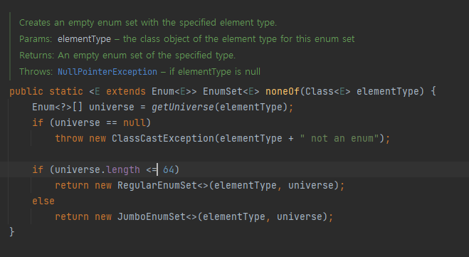

# 생성자 대신 정책 팩터리 메서드를 고려하라
## 장점
### 이름을 가질 수 있다.
- 생성자에 넘기는 매개변수와 생성자 자체만으로 반환될 객체의 특성을 제대로 설명하지 못한다.

### 호출될 때마다 인스턴스를 새로 생성하지 않아도 된다.
- 대표적으로 `Boolean.valueOf(boolean)`과 같은게 있다.
- 같은 객체가 자주 요청되는 상황이라면 성능을 상당히 끌어올려준다.
- 이런 클래스를 인스턴스 통제(instance-controlled)클래스라고 한다.
- 인스턴스를 통제하면 클래스를 싱글턴으로 만들 수도, 인스턴스화 불가로 만들수도 있다.

### 반환 타입의 하위 객체를 반환할 수 있는 능력이 있다.
- 예시로는 `java.util.Collections`가 있다.
- 자바 컬렉션 프레임워크는 핵심 인터페이스들에 수정 불가나 동기화 등의 기능을 덧붙인 총 45개의 유틸리티 구현체를 제공하는데, 이 구현체 대부분을 단 하나의 인스턴스화 불가 클래스인 `java.util.Collections`에서 정적 팩터리 메서드를 통해 얻도록 했다.
- 자바 8부터는 인터페이스가 정적 메소드를 가질 수 있게되었다. 과거에는 Factory 인터페이스가 있다면 인스턴스화가 불가능한 Factories 클래스를 통해 정적 메소드 팩토리를 만들어 줬어야했다.
```java
interface Factory {

  static Factory createEngine(){
    return Engine.getInstance();
  }
  static Factory createDoor(){
    return Door.getInstance();
  }
  void sayHello();

}
```
```java
public class Door implements Factory{

  private Door(){
  }

  public static Door getInstance(){
    System.out.println("created Door");
    return new Door();
  }

  @Override
  public void sayHello() {
    System.out.println("hello I'm Door");
  }
}
```
```java
public class Engine implements Factory{

  private Engine(){}

  static Factory getInstance() {
    System.out.println("Created Engine");
    return new Engine();
  }

  @Override
  public void sayHello() {
    System.out.println("hello I'm Engine");
  }
}
```


### 입력 매개변수에 따라 매번 다른 클래스의 객체를 반환할 수 있다.
- 예시로는 `EnumSet`가 있다.
- 원소가 64개 이하 일때와 초과일때 다른 인스턴스를 반환한다.


### 정적 팩터리 메서드를 작성하는 시점에는 반환할 객체의 클래스가 존재하지 않아도 된다.
- JDBC같은 유연한 서비스 제공자 프레임워크를 만드는 근간이된다.
- 제공자(provider)는 서비스의 구현체다.
- 서비스 제공자 프레임워크는 3개의 핵심 컴포넌트로 이뤄진다.
  - 구현체의 동작을 정의하는 `서비스 인터페이스(service Interface)`
    - JDBC에서 `Connection`인터페이스가 그 예시다. 
  - 제공자가 구현체를 등록할 때 사용하는 `제공자 등록 API(provider registration API)`
    - JDBC에서 `DriverManager.registerDriver`가 그 예시다. 
  - 클라이언트가 서비스의 인스턴스를 얻을 때 사용하는 `서비스 접근 API(service access API)`
    - JDBC에서 `DriverManager.getConnection`이 그 예시다.

## 단점
### 상속을 하려면 public이나 protected 생성자가 필요하니 정적 팩터리 메서드만 제공하면 하위 클래스를 만들 수 없다.
- 컬렉션 프레임워크의 유틸리티 구현 클래스들은 상속할 수 없다.
- 상속보다 컴포지션을 사용하도록 유도하고,
### 정적 팩터리 메서드는 프로그래머가 찾기 어렵다.
- 개발자가 정적 팩터리 메서드를 뒤지면서 어떤 인스턴스가 생성되는지 찾아내야한다.
- 가능하면 아래의 명명규칙을 따르면서 찾기 쉽도록하자.
  - `from` : 매개변수를 하나 받아서 해당 타입의 인스턴스를 반환하는 형변환 메서드
    - `Date d = Date.from(instant);`
  - `of` : 여러 매개변수를 받아 적합한 타입의 인스턴스를 반환하는 집계 메서드
    - `Set<Rank> faceCards = EnumSet.of(JACK,QUEEN,KING);`
  - `valueOf` : from과 of의 더 자세한 버전
    - `BigInteger prime = BigInteger.valueOf(Integer.MAX_VALUE);`
  - `instance` 혹은 `getInstance` : (매개변수를 받는다면) 매개변수로 명시한 인스턴스를 반환하지만, 같은 인스턴스임을 보장하지는 않는다.
    - `StackWalker luke = StackWalker.getInstance(options);`
  - `create` 혹은 `newInstance` : instance 혹은 getInstance와 같지만, 매번 새로운 인스턴스를 생성해 반환함을 보장한다.
    - `Object newArray = Array.newInstance(classObject< arrayLen);`
  - `getType` : getInstance와 같으나, 생성할 클래스가 아닌 다른 클래스에 팩터리 메서드를 정의할 때 쓴다. "Type"은 팩터리 메서드가 반환할 객체의 타입이다.
    - `FileStore fs = Files.getFileStore(path);` 
  - `newType` : newInstance와 같으나, 생성할 클래스가 아닌 다른 클래스에 팩터리 메서드를 정의할 때 쓴다. "Type"은 팩터리 메서드가 반환할 객체의 타입이다.
    - `BufferedReader br = Files.newBufferedReader(path);`
  - `Type` : getType과 newType의 간결한 버전
    - `List<Complaint> litany = Collections.list(legacyLitany);` 