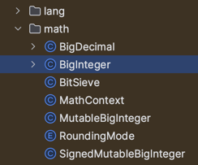
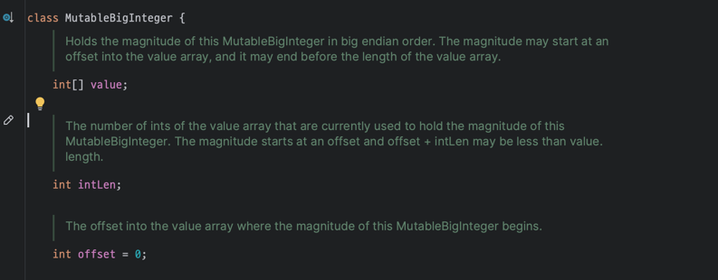
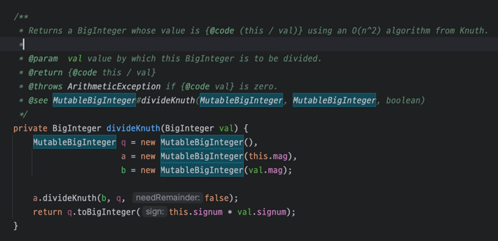

# 변경 가능성을 최소화하라

## 불변클래스는 무엇이고, 어떻게 만들까?

### 불변클래스란?

불변클래스란 간단히 말해 그 **인스턴스의 내부 값을 수정할 수 없는 클래스** 다. 불변 인스턴스에 간직된 정보는 고정되어 객체가 파괴되는 순간까지 절대 달라지지 않는다.

### 저자는 클래스를 불변으로 만들기 위한 규칙 5가지가 있다고 이야기한다.

- 객체의 상태를 변경하는 메서드(변경자)를 제공하지 않는다.
- 클래스를 확장할 수 없도록 한다. 하위 클래스에서 부주의하게 혹은 나쁜 의도로 객체의 상태를 변하게 만드는 사태를 막아준다.
- 모든 필드를 final 로 선언한다. 시스템이 강제하는 수단을 이용해 설계자의 의도를 명확히 드러내는 방버이다.
- 모든 필드를 private 으로 선언한다. 필드가 참조하는 가변 객체를 클라이언트에서 직접 접근해 수정하는 일을 막아준다. <br/> 기술적으로는 불편객체를 참조하는 필드를 public final 로만 선언해도 불변객체가 되자만, 이렇게 하면 다음 릴리스에서 내부 표현을 바꾸지 못하므로 권하지는 않는다.
- 자신 외에는 내부의 가변 컴포넌트에 접근할 수 없도록 한다. 클래스에 가변 객체를 참조하는 필드가 하나라도 있다면 클라이언트에서 그 객체의 참조를 얻을 수 없도록 해야한다. getter 에서도 해당 필드를 참조할 수 있도록 바로 제공하는 것이 아닌 방어적 복사를 수행해야한다.

<br/>
<br/>

### 그렇다면, 불변 클래스의 장점은 무엇일까?

#### 1. 불변 객체는 단순하다.

불변객체는 생성된 시점의 상태를 파괴될 때까지 그대로 간직한다. 반면에 가변 객체는 임의의 복잡한 상태에 놓일 수 있어, 변경자 메서드가 일으키는 상태 전이를 정밀하게 문서로 남겨놓지 않은 가변 클래스는 믿고 사용하기 어려울 수 있다.

#### 2. 스레드 안전하다.

불변 객체는 근본적으로 스레드 안전하여 따로 동기화할 필요 없다. 여러 스레드에서 동시에 사용해도 절대 훼손되지 않는다. <br/>
불변 객체에 대해서는 그 어떤 스레드도 다른 스레드에 영향을 줄 수 없으니 불변 객체는 안심하고 공유할 수 있다.

그렇기 때문에 불변객체는 최대한 재활용하기를 권한다.
```java
public static final Complex ZERO = new Complex(0. 0);
public static final Complex ONE = new Complex(1, 0);
```
이처럼 불변 클래스는 자주 사용되는 인스턴스를 상수로 제공할 수 도 있고, 캐싱하여 같은 인스턴스를 중복 생성하지 않게 해주는 정적 팩토리 메서드를 제공할 수 있다.

또한, 불변 객체는 자유롭게 공유할 수 있다는 점은 방어적 복사도 필요 없다는 결론으로 이어진다.

#### 3. 불변 객체 끼리는 내부 데이터를 공유할 수 있다.

불변 객체는 자유롭게 공유할 수 있음은 물론, 불변 객체끼리는 내부 데이터를 공유할 수 있다. <br/>
예컨대 BigInteger 클래스는 내부에서 값의 부호(sign)와 크기(magnitude)를 따로 표현한다. 부호는 int 변수를, 크기(절댓값)에 int 배열을 사용하는 것이다. <br/>
한편 negate 메서드는 크기가 같고 부호만 반대인 새로운 BigInteger를 생성하는데, 이때 배열은 비록 가변이지만 방어적 복사하지 않고 원본 인스턴스와 공유해도 된다. <br/>
그 결과 새로 만든 BigInteger 인스턴스도 원본 인스턴스가 가리키는 내부 배열을 그대로 가리킨다.

#### 4. 객체를 생성할 때 불편 객체들을 구성요소로 사용하면 이점이 많다.

객체를 만들 때 다른 불변 객체들을 구성요소로 사용하면 이점이 많은데, 값이 바뀌지 않는 구성요소들로 이뤄진 객체라면, 그 구조가 아무리 복잡하더라도 불변식을 유지하기 훨씬 수월하기 때문이다.

#### 5. 실패원자성을 제공한다.

불변 객체는 그 자체로 실패원자성을 제공한다. 상태가 절대 변하지 않으니 잠깐이라도 불일치 상태에 빠질 가능성이 없다.

<br/>
<br/>

### 불변 클래스는 단점이 없을까?

불변 클래스에도 단점은 있다. 값이 다르면 반드시 독립된 객체로 만들어야 한다는 것이다. 값의 가짓수가 많다면 이들을 모두 만드는 데 큰 비용을 치러야 한다. <br/>
예를 들어 백만 비트짜리 BigInteger 에서 비트 하나를 바꿔야 한다고 해보자.

```java
BigInteger moby = ...;
moby = moby.flipBit(0);
```
filpBit 메서드는 새로운 BigInteger 인스턴스를 생성한다. 원본과 단지 한 비트만 다른 백만 비트짜리 인스턴스를 말이다.
이처럼, 원하는 객체를 완성하기까지의 단계가 많고, 그 중간 단계에서 만들어진 객체들이 모두 버려진다면 성능 문제가 더 불거진다. 이 문제를 대처하는 방법은 두 가지 이다.

#### 첫번째는 private-package 가변 동반클래스를 활용하라

흔히 쓰일 다단계 연산들을 예측하여 기본 기능으로 제공하는 것이다. 이러한 다단계 연산을 기본으로 제공한다면 더 이상 각 단계마다 객체를 생성하지 않아도 된다.<br/>
예를 들어, BigInteger 는 모듈러 지수 같은 다단계 연산 속도를 높여주는 **가변 동반 클래스를 private-package 으로 두고 있다.**





BitInteger 패키지 내 MutableBigInteger 클래스가 가변 동반 클래스로, BigInteger 메서드 중 divideKnuth 와 같이 안에서 내부적으로 private-package 가변 동반클래스를 활용해 연산 속도를 높여주도록 구현되어 있다.



#### 두번째는 public 가변 동반클래스를 제공하라

클라이언트들이 원하는 복잡한 연산들을 정확히 예측할 수 있다면 첫번째 방법인 private-package의 가변 동반클래스만으로도 충분하지만, 예측이 안된다면 public 으로 제공하는 것이다. <br/>
자바 플랫폼에서 대표적인 예가 String 클래스이며, String의 가변 동반클래스는 StringBuilder 이다.

<br/>
<br/>

### 불변클래스를 만들기 위해 상속을 방지하는 방법을 어떤 것이 있을까?

클래스가 불변임을 보장하려면 자신을 상속하지 못하게 해야 함을 기억할 것이다. 상속하지 못하게 하는 방법은 다음과 같다.

#### final 클래스로 선언하라

상속을 방지하는 가장 쉬운 방법은 final 클래스로 선언하는 것이다. 하지만 위의 방법보다 더 유연하게 만드는 방법이 있다.

#### 모든 생성자를 private 혹은 package-private 으로 만들고 public 정적 팩터리를 제공하라

final 클래스로 선언하는 방법보다 좀 더 유연한 방법은 모든 생성자를 private 혹은 package-private 으로 만들고 public 정적 팩터리 메서드를 제공하는 것이다.

```java
public class Complex {
    
    private final double re;
    private final double im;

    private Complex(double re, double im) {
        this.re = re;
        this.im = im;
    }

    public static Complex valueOf(double re, double im) {
        return new Complex(re, im);
    }
    
    ... // 나머지 코드는 생략
}
```

이 방식을 사용하게 되면, 바같에서 볼 수 없는 package-private 구현 클래스를 원하는 만큼 만들어 활용할 수 있으니 훨씬 유연하다. 패키지 바깥의 클라이언트에서 바라본 이 불변 객체는 사실상 final 이다.<br/>
또한, 정적 팩터리 메서드를 사용하기 때문에 다음 릴리스에서 객체 캐싱 기능을 추가해 성능을 끌어올릴 수도 있다.

#### 상속을 방지하지 않으면 생기는 이슈는 무엇일까?

BigInteger 와 BigDecimal 을 설계할 당시 불변객체가 사실상 final 이어야한다는 생각이 널리 퍼지지 않아, 이 두 클래스의 메서드들을 재정의할 수 있게 설계되었고 현재도 하위호환성이 발목을 잡아 지금까지도 이 문제가 고치지 못했다.  <br/>
그래서, BigInteger 혹은 BigDecimal 의 값이 불변이어야 보안을 지킬 수 있다면 인수로 받은 객체가 진짜 BigInteger 혹은 BigDecimal 인지 확인해야 한다.


<br/>
<br/>

### 불변클래스를 만들기 위해 모든 필드를 final 선언하는 규칙은 괜찮을가?

불변클래스를 만들기 위해 '모든 필드를 final이고 어떤 메서드도 그 객체를 수정할 수 없어야 한다.' 규칙이 있는데 이 규칙은 과한 감이 있어서 성능을 위해 다음과 같이 완화할 수 있다. <br/>
'어떤 메서드도 객체의 상태 중 외부에 비치는 값을 변경할 수 없다.' 즉, 어떤 불변 클래스는 계산 비용이 큰 값을 나중에 (처음 쓰일 때) 계산하여 final 이 아닌 필드에 캐시할 수도 있다. <br/>
객체가 불변이기 때문에 똑같은 값을 다시 요청하면 캐시해둔 값을 반환하여 계산 비용을 절감하는 것이다.

즉, 지연 초기화를 활용할 수 있다.

<br/>
<br/>

### 정리

- getter 가 있다고 무조건 setter를 만들지 말자
- 클래스는 꼭 필요힌 경우가 아니라면 불변이어야 한다.
  - 불변 객체로 인해 성능 이슈가 발생한다면 가변동반 클래스를 활용하거나 캐싱을 활용하자
- 불변으로 만들 수 없는 클래스라도 변경할 수 있는 부분을 최소한으로 줄이자.
- 합당한 이유가 없다면 모든 필드는 private final 이어야 한다.
- 생성자는 불변식 설정이 모두 완료된, 초기화가 완벽히 끝난 상태의 객체를 생성해야 한다.
